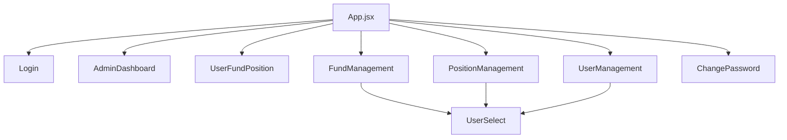
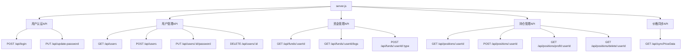
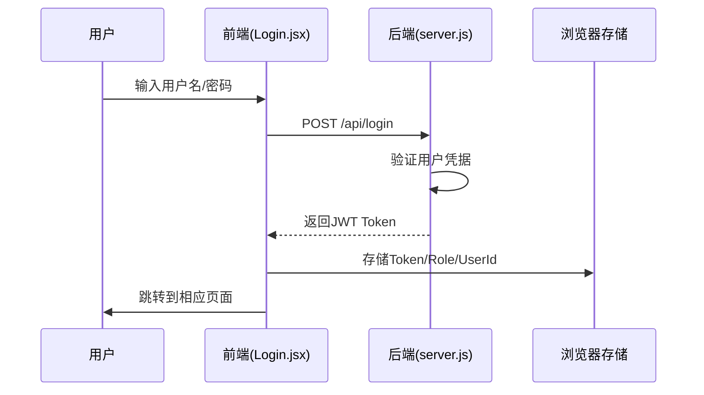
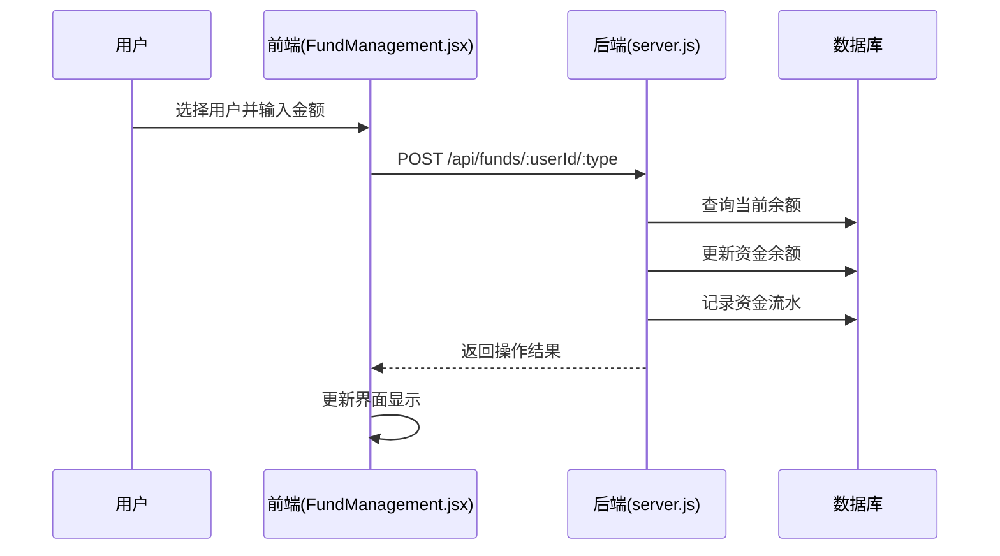
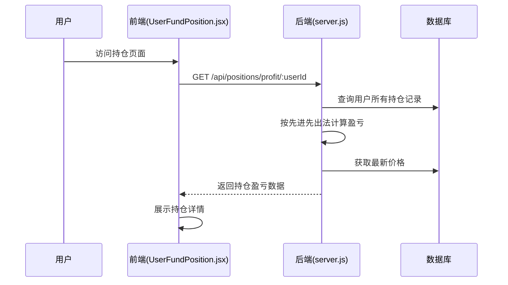

# Trading Custody 系统架构分析与优化建议

## 1. 概述

Trading Custody 是一个基于 React 和 Express 的交易与托管管理系统，支持用户登录、资金管理、持仓管理及管理员功能。系统采用前后端分离架构，前端使用 React + Ant Design Mobile，后端使用 Express + SQLite，通过 JWT 进行身份认证。

## 2. 系统架构分析

### 2.1 技术架构

#### 前端架构
- **框架**: React v18
- **UI库**: Ant Design Mobile v5
- **路由**: React Router v6
- **状态管理**: React 内置状态管理（useState, useEffect）
- **构建工具**: react-scripts (Create React App)
- **移动端适配**: 使用 Ant Design Mobile 组件库

#### 后端架构
- **框架**: Express.js
- **数据库**: SQLite
- **认证**: JWT (JSON Web Token)
- **API风格**: RESTful API
- **定时任务**: node-schedule
- **跨域处理**: cors 中间件

#### 架构模式
- **前后端分离**: 前端通过 REST API 与后端通信
- **MVC模式**: 后端采用路由-控制器-数据访问的分层结构
- **SPA模式**: 前端为单页应用，通过路由管理不同视图

### 2.2 系统组件结构

#### 前端组件结构

#### 后端API结构

### 2.3 数据模型设计

#### 用户模型 (users)
| 字段 | 类型 | 描述 |
|------|------|------|
| id | INTEGER | 主键，自增 |
| name | TEXT | 用户名 |
| email | TEXT | 邮箱 |
| password | TEXT | 密码 |
| role | TEXT | 角色(user/admin) |

#### 资金模型
| 表名 | 字段 | 类型 | 描述 |
|------|------|------|------|
| funds | id | INTEGER | 主键，自增 |
| | user_id | INTEGER | 用户ID，外键 |
| | balance | REAL | 余额 |
| fund_logs | id | INTEGER | 主键，自增 |
| | user_id | INTEGER | 用户ID，外键 |
| | type | TEXT | 操作类型(initial/deposit/withdraw) |
| | amount | REAL | 金额 |
| | remark | TEXT | 备注 |
| | timestamp | DATETIME | 时间戳 |

#### 持仓模型
| 表名 | 字段 | 类型 | 描述 |
|------|------|------|------|
| positions | id | INTEGER | 主键，自增 |
| | user_id | INTEGER | 用户ID，外键 |
| | asset_type | TEXT | 资产类型(stock/future/fund) |
| | code | TEXT | 代码 |
| | name | TEXT | 名称 |
| | operation | TEXT | 操作类型(buy/sell) |
| | price | REAL | 价格 |
| | quantity | INTEGER | 数量 |
| | timestamp | DATETIME | 时间戳 |
| | fee | REAL | 交易费用 |
| price_data | code | TEXT | 资产代码 |
| | asset_type | TEXT | 资产类型 |
| | current_price | REAL | 当前价格 |
| | timestamp | DATETIME | 时间戳 |

## 3. 核心业务逻辑分析

### 3.1 用户认证流程

### 3.2 资金管理流程

### 3.3 持仓盈亏计算流程

## 4. 现有架构的优点

1. **技术栈成熟稳定**: React + Express + SQLite 都是成熟的技术方案，社区支持好
2. **架构清晰**: 前后端分离，职责明确，便于维护和扩展
3. **功能完整**: 实现了交易账户管理的核心功能，包括用户、资金、持仓管理
4. **移动端适配**: 使用 Ant Design Mobile，具有良好的移动端用户体验
5. **数据驱动**: 通过 SQLite 实现数据持久化，满足基础需求
6. **定时任务**: 实现了价格数据的定时同步机制

## 5. 架构存在的问题与风险

### 5.1 安全性问题
1. **密码明文存储**: 用户密码以明文形式存储在数据库中，存在严重安全隐患
2. **JWT密钥硬编码**: JWT签名密钥直接硬编码在代码中，容易泄露
3. **缺乏输入验证**: 前端和后端都缺乏完善的输入验证机制
4. **无权限控制**: API接口缺乏细粒度的权限控制

### 5.2 性能与扩展性问题
1. **数据库瓶颈**: SQLite在高并发场景下性能较差，不支持水平扩展
2. **同步阻塞**: 后端使用同步数据库操作，影响响应性能
3. **价格同步机制**: 定时任务同步所有持仓价格，效率较低
4. **缺乏缓存**: 未使用缓存机制，重复查询数据库增加负载

### 5.3 代码质量问题
1. **错误处理不完善**: 部分API接口缺少错误处理逻辑
2. **日志记录不足**: 缺乏详细的日志记录，不利于问题排查
3. **代码重复**: 部分功能在前后端存在重复实现
4. **缺乏测试**: 项目中未包含单元测试或集成测试

### 5.4 功能局限性
1. **资产类型有限**: 仅支持股票、期货、基金三种资产类型
2. **计算逻辑简单**: 盈亏计算仅使用先进先出法，未考虑其他算法
3. **数据来源单一**: 依赖外部API获取价格数据，缺乏备用方案
4. **报表功能缺失**: 缺乏详细的交易报表和分析功能

## 6. 优化建议

### 6.1 安全性优化
1. **密码加密存储**:
   - 使用 bcrypt 或 argon2 对用户密码进行哈希加密存储
   - 添加盐值防止彩虹表攻击

2. **JWT安全增强**:
   - 将JWT密钥移到环境变量中
   - 设置合理的过期时间（如1小时）
   - 添加刷新令牌机制
   - 实施令牌黑名单机制，支持令牌撤销

3. **API安全防护**:
   - 实现API请求频率限制（如每分钟最多100次请求）
   - 添加输入验证和参数过滤（使用Joi或express-validator等库）
   - 实施细粒度权限控制（基于角色的访问控制RBAC）
   - 添加HTTPS支持

### 6.2 性能优化
1. **数据库升级**:
   - 考虑迁移到 PostgreSQL 或 MySQL
   - 添加数据库索引优化查询性能
   - 实现读写分离

2. **缓存机制**:
   - 引入 Redis 缓存频繁访问的数据
   - 对价格数据进行缓存，减少API调用

3. **异步处理**:
   - 使用异步数据库操作
   - 将耗时操作（如价格同步）放到后台任务中

### 6.3 功能扩展
1. **增加资产类型**:
   - 支持外汇、债券等其他资产类型
   - 实现资产分类管理

2. **完善盈亏计算**:
   - 支持多种盈亏计算方法（平均成本法等）
   - 添加税收计算功能

3. **报表与分析**:
   - 实现交易报表生成功能
   - 添加收益分析图表

4. **通知机制**:
   - 实现价格变动提醒
   - 添加交易确认通知

### 6.4 代码质量提升
1. **完善错误处理**:
   - 统一错误处理机制（使用Express.js错误处理中间件）
   - 添加详细的日志记录（使用winston或morgan等日志库）
   - 实现错误码标准化
   - 添加错误堆栈跟踪（仅在开发环境中）

2. **添加测试**:
   - 编写单元测试覆盖核心功能（使用Jest框架）
   - 实现集成测试验证API接口（使用Supertest库）
   - 添加端到端测试（使用Cypress或Puppeteer）
   - 实现测试覆盖率监控

3. **代码重构**:
   - 提取公共组件和工具函数（如API调用封装、通用工具函数）
   - 优化代码结构和命名规范（遵循项目规则中的命名规范）
   - 实现代码模块化（将相关功能组织到独立模块中）
   - 添加代码注释和文档

### 6.5 部署与运维优化
1. **容器化部署**:
   - 使用 Docker 容器化应用
   - 实现一键部署脚本

2. **监控与告警**:
   - 添加应用性能监控
   - 实现异常告警机制

3. **备份与恢复**:
   - 实现数据库定期备份
   - 添加数据恢复机制

## 7. 实施优先级建议

### 高优先级（立即处理）
1. 密码加密存储
2. JWT密钥安全存储
3. 输入验证和参数过滤
4. 添加详细日志记录

### 中优先级（短期规划）
1. 数据库索引优化
2. 引入缓存机制
3. 完善错误处理
4. 编写核心功能测试

### 低优先级（长期规划）
1. 数据库迁移
2. 容器化部署
3. 报表与分析功能
4. 多资产类型支持

## 8. 总结

Trading Custody 系统整体架构清晰，功能完整，适合中小规模用户使用。但在安全性、性能和扩展性方面存在一些问题需要改进。通过实施上述优化建议，可以显著提升系统的安全性、性能和用户体验，为后续功能扩展奠定良好基础。