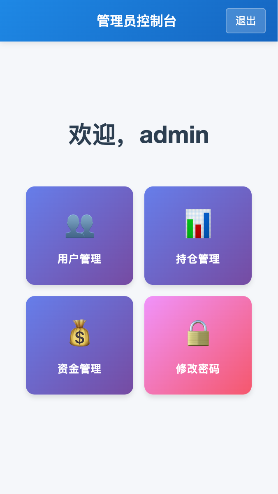

# 📊 Trading Custody - 交易托管管理平台

<div align="center">


**一个现代化的交易资金托管与持仓管理系统**

[功能特性](#-功能特性) • [快速开始](#-快速开始) • [技术架构](#-技术架构) • [部署指南](#-部署指南) • [文档](#-文档)

</div>

---

## 📸 产品预览

<div align="center">
  
  <p><i>管理员控制台 - 一站式管理用户、资金和持仓</i></p>
</div>

## ✨ 功能特性

### 🔐 用户管理
- **安全认证**：基于 JWT 的身份验证机制，支持 Cookie 持久化
- **角色权限**：管理员/普通用户双角色体系，细粒度权限控制
- **用户操作**：用户创建、信息管理、密码修改、权限分配
- **资源隔离**：普通用户只能访问自己的资源，管理员可管理所有用户

### 💰 资金管理
- **余额跟踪**：实时查看用户资金余额
- **资金操作**：支持初始资金设置、资金追加、资金取出
- **操作日志**：完整的资金流水记录，可追溯每一笔资金变动
- **多用户支持**：管理员可查看和管理所有用户的资金状况

### 📈 持仓管理
- **多资产支持**：支持股票、期货、基金等多种资产类型
- **持仓记录**：详细记录买入/卖出操作，包括价格、数量、时间等
- **收益计算**：自动计算持仓盈亏，实时展示投资收益
- **价格同步**：定时自动同步市场价格数据（支持股票和期货）
- **持仓分析**：提供持仓汇总和收益分析功能

### 🚀 系统特性
- **响应式设计**：基于 Ant Design Mobile，完美适配移动端和桌面端
- **实时更新**：数据实时刷新，确保信息准确性
- **定时任务**：支持 Cron 表达式配置的定时价格同步（默认每天 17:00）
- **日志记录**：完善的日志系统，便于问题排查和审计
- **容器化部署**：提供完整的 Docker 部署方案，开箱即用

## 🛠 技术架构

### 前端技术栈
- **框架**：React 18 - 现代化的前端框架
- **路由**：React Router DOM - 单页应用路由管理
- **UI 组件**：Ant Design Mobile - 移动端优先的 UI 组件库
- **状态管理**：React Context API - 轻量级状态管理
- **HTTP 客户端**：基于 Fetch 的自定义 API 客户端
- **构建工具**：Create React App - 零配置快速开发

### 后端技术栈
- **框架**：Express.js - 轻量高效的 Node.js Web 框架
- **数据库**：SQLite - 轻量级嵌入式数据库，零配置
- **认证**：JWT + Cookie - 安全的身份验证机制
- **密码加密**：Bcrypt - 行业标准的密码哈希算法
- **日志系统**：Winston - 强大的日志记录工具
- **定时任务**：Node Schedule - 灵活的任务调度
- **数据验证**：Express Validator - 请求数据验证

### 架构设计
```
┌─────────────────┐
│   React 前端    │ ← Ant Design Mobile UI
└────────┬────────┘
         │ RESTful API
         ↓
┌─────────────────┐
│  Express 后端   │ ← JWT 认证 + 中间件
└────────┬────────┘
         │
    ┌────┴────┐
    ↓         ↓
┌────────┐ ┌──────────┐
│ SQLite │ │ 定时任务  │ ← 价格数据同步
└────────┘ └──────────┘
```

## 🚀 快速开始

### 前置要求
- Node.js 16+ （推荐 18+）
- npm 或 yarn
- （可选）Docker 和 Docker Compose
- （推荐）PM2 进程管理器

### 本地开发

#### 1. 克隆项目
```bash
git clone https://github.com/yushukk/trading-custody.git
cd trading-custody
```

#### 2. 安装依赖
```bash
npm install
```

#### 3. 配置环境变量
```bash
cp .env.example .env
```

编辑 `.env` 文件，配置必要的环境变量：
```env
# 服务器配置
PORT=3001
NODE_ENV=development

# JWT 配置
JWT_SECRET=your-secret-key-here
JWT_EXPIRES_IN=7d

# 数据库配置
DB_PATH=./database.sqlite

# 定时任务配置（Cron 表达式）
PRICE_SYNC_CRON=0 17 * * *  # 每天 17:00 执行
```

#### 4. 启动开发服务器
```bash
# 启动后端服务（端口 3001）
npm run server

# 新开一个终端，启动前端服务（端口 3000）
npm run client
```

#### 5. 访问应用
打开浏览器访问 `http://localhost:3000`

**默认管理员账号**：
- 用户名：`admin`
- 密码：`admin`（首次登录后请及时修改）

## 📦 部署方式

### 方式一：传统服务器部署

**适用场景**：传统服务器、VPS、无 Docker 环境

**特点**：
- ✅ 无需 Docker，直接在服务器上运行
- ✅ 完全控制进程和配置
- ✅ 适合传统运维环境

#### 一键部署脚本（推荐）⭐

> 💡 **无需任何前置准备**：部署脚本会自动检查并安装所需的环境（Node.js、PM2 等）

我们提供了自动化部署脚本，支持多种获取代码的方式：

**方式 A：ß快速部署（推荐，无需 Git）**

一条命令完成所有操作，自动下载、解压并部署：

```bash
# 下载并运行快速部署脚本
wget -O quick-deploy.sh https://raw.githubusercontent.com/yushukk/trading-custody/main/quick-deploy.sh && chmod +x quick-deploy.sh && ./quick-deploy.sh

# 或使用 curl
curl -o quick-deploy.sh https://raw.githubusercontent.com/yushukk/trading-custody/main/quick-deploy.sh && chmod +x quick-deploy.sh && ./quick-deploy.sh
```

**特点**：
- ✅ 无需安装 Git
- ✅ 自动下载最新版本
- ✅ 自动解压和部署
- ✅ 一条命令搞定一切

---

**方式 B：使用 Git 克隆**

适合已安装 Git 的环境，方便后续更新：

```bash
# 克隆项目
git clone https://github.com/yushukk/trading-custody.git
cd trading-custody

# 运行部署脚本
chmod +x deploy.sh
./deploy.sh
```

---

**方式 C：手动下载部署**

适合网络受限或需要离线部署的场景：

```bash
# 1. 下载压缩包
wget https://github.com/yushukk/trading-custody/archive/refs/heads/main.zip
# 或使用 curl
curl -L https://github.com/yushukk/trading-custody/archive/refs/heads/main.zip -o main.zip

# 2. 解压
unzip main.zip
cd trading-custody-main

# 3. 运行部署脚本
chmod +x deploy.sh
./deploy.sh
```

> 💡 **提示**：如果服务器没有安装 wget 或 curl，可以在本地下载后通过 scp 或 FTP 上传到服务器

**脚本功能**
- ✅ 自动检查 Node.js 和 PM2 环境
- ✅ 自动安装依赖
- ✅ 自动配置环境变量
- ✅ 自动编译前端
- ✅ 使用 PM2 管理进程
- ✅ 自动配置开机自启
- ✅ 可选生成 Nginx 配置文件

**重要提示**
- 💡 系统会在首次启动时自动生成 JWT 密钥
- ⚠️ 集群部署时，请确保所有节点使用相同的 JWT 密钥
- 📝 集群部署步骤：
  1. 在首个节点运行部署脚本
  2. 启动后查看生成的 JWT 密钥（在 `.env` 文件中）
  3. 将密钥复制到其他节点的 `.env` 文件中
  4. 在其他节点运行部署脚本


#### 进程管理

使用 PM2 管理进程：
```bash
# 查看进程状态
pm2 status

# 查看日志
pm2 logs trading-custody-backend

# 重启服务
pm2 restart trading-custody-backend

# 停止服务
pm2 stop trading-custody-backend

# 删除进程
pm2 delete trading-custody-backend
```

#### 更新部署

**方式 A：一键更新（推荐，无需 Git）**

使用快速更新脚本，自动下载最新版本并更新：

```bash
# 下载并运行快速更新脚本
wget -O quick-update.sh https://raw.githubusercontent.com/yushukk/trading-custody/main/quick-update.sh && chmod +x quick-update.sh && ./quick-update.sh

# 或使用 curl
curl -o quick-update.sh https://raw.githubusercontent.com/yushukk/trading-custody/main/quick-update.sh && chmod +x quick-update.sh && ./quick-update.sh
```

**特点**：
- ✅ 无需 Git
- ✅ 自动备份当前版本
- ✅ 自动下载最新代码
- ✅ 保留配置文件和数据
- ✅ 自动重启服务

---

**方式 B：使用 Git 更新**

适合使用 Git 克隆的部署：

```bash
# 拉取最新代码
git pull

# 重新运行部署脚本
./deploy.sh
```

---

**方式 C：手动更新**

适合需要精确控制的场景：

```bash
# 1. 备份当前版本
cp -r . ../trading-custody-backup

# 2. 下载最新版本
wget https://github.com/yushukk/trading-custody/archive/refs/heads/main.zip
unzip main.zip

# 3. 保留配置和数据
cp .env trading-custody-main/
cp -r database.sqlite trading-custody-main/ 2>/dev/null || true

# 4. 替换旧版本
cd trading-custody-main
chmod +x deploy.sh
./deploy.sh
```

---

## 🐳 Docker 部署

### 方式二：生产服务器部署（推荐）⭐

**适用场景**：生产环境、容器平台（如飞牛）、快速部署

**特点**：
- ✅ 使用预构建的 Docker Hub 镜像，无需本地构建
- ✅ 零配置，开箱即用
- ✅ JWT 密钥自动生成
- ✅ 所有配置都有合理的默认值

#### 快速部署
```bash
# 下载配置文件
wget https://raw.githubusercontent.com/yushukk/trading-custody/main/docker-compose.simple.yml

# 启动服务
docker-compose -f docker-compose.simple.yml up -d
```

服务将在以下端口启动：
- 前端：`http://localhost:80`
- 后端 API：`http://localhost:3001`（容器内部，不对外暴露）

#### 查看日志
```bash
docker-compose -f docker-compose.simple.yml logs -f
```

#### 停止服务
```bash
docker-compose -f docker-compose.simple.yml down
```

#### 自定义配置（可选）
如需自定义配置，可以编辑 `docker-compose.simple.yml` 文件中的环境变量：
```yaml
environment:
  # 自定义 JWT 密钥（可选，不配置则自动生成）
  - JWT_ACCESS_SECRET=your-custom-secret
  
  # 修改 CORS 配置（生产环境建议改为具体域名）
  - CORS_ORIGIN=https://yourdomain.com
  
  # 修改价格同步时间
  - PRICE_SYNC_CRON=0 9,17 * * *  # 每天 9:00 和 17:00
```

### 方式三：本地开发部署

**适用场景**：本地开发、需要自定义构建、调试

**特点**：
- ✅ 从本地源码构建镜像
- ✅ 支持完全自定义配置
- ✅ 后端端口对外暴露，方便调试
- ✅ 可修改源码后重新构建

```bash
# 克隆项目
git clone https://github.com/yushukk/trading-custody.git
cd trading-custody

# 启动服务（会自动构建镜像）
sh docker-deploy.sh
```

服务将在以下端口启动：
- 前端：`http://localhost:3000`
- 后端 API：`http://localhost:3001`


### 数据持久化

两种部署方式都配置了数据卷挂载，数据将持久化保存：
- **数据库**：`backend-data` 卷
- **日志文件**：`backend-logs` 卷

查看数据卷：
```bash
docker volume ls | grep trading-custody
```

备份数据：
```bash
# 备份数据库
docker run --rm -v trading-custody_backend-data:/data -v $(pwd):/backup alpine tar czf /backup/database-backup.tar.gz -C /data .

# 备份日志
docker run --rm -v trading-custody_backend-logs:/logs -v $(pwd):/backup alpine tar czf /backup/logs-backup.tar.gz -C /logs .
```

## 📚 项目结构

```
trading-custody/
├── src/                      # 前端源代码
│   ├── components/          # React 组件
│   ├── api/                 # API 客户端
│   ├── contexts/            # Context 状态管理
│   ├── hooks/               # 自定义 Hooks
│   └── styles/              # 样式文件
├── server/                   # 后端源代码
│   ├── controllers/         # 控制器层
│   ├── services/            # 业务逻辑层
│   ├── dao/                 # 数据访问层
│   ├── middleware/          # 中间件
│   ├── validators/          # 数据验证
│   ├── utils/               # 工具函数
│   └── migrations/          # 数据库迁移
├── docs/                     # 文档和截图
├── public/                   # 静态资源
├── docker-compose.yml       # Docker Compose 配置
├── Dockerfile.backend       # 后端 Dockerfile
├── Dockerfile.frontend      # 前端 Dockerfile
└── package.json             # 项目依赖
```

## 🔧 配置说明

### 环境变量

| 变量名 | 说明 | 默认值 |
|--------|------|--------|
| `PORT` | 后端服务端口 | `3001` |
| `NODE_ENV` | 运行环境 | `development` |
| `JWT_SECRET` | JWT 密钥（必须修改） | - |
| `JWT_EXPIRES_IN` | JWT 过期时间 | `7d` |
| `DB_PATH` | 数据库文件路径 | `./database.sqlite` |
| `PRICE_SYNC_CRON` | 价格同步 Cron 表达式 | `0 17 * * *` |

### 定时任务配置

价格同步任务使用 Cron 表达式配置，格式说明：
```
* * * * *
│ │ │ │ │
│ │ │ │ └─ 星期几 (0-7, 0 和 7 都表示周日)
│ │ │ └─── 月份 (1-12)
│ │ └───── 日期 (1-31)
│ └─────── 小时 (0-23)
└───────── 分钟 (0-59)
```

示例：
- `0 17 * * *` - 每天 17:00 执行
- `0 */6 * * *` - 每 6 小时执行一次
- `0 9,17 * * 1-5` - 工作日的 9:00 和 17:00 执行

## 🔒 安全建议

1. **修改默认密码**：首次部署后立即修改管理员默认密码
2. **配置强密钥**：使用强随机字符串作为 `JWT_SECRET`
3. **HTTPS 部署**：生产环境建议配置 HTTPS
4. **定期备份**：定期备份数据库文件
5. **日志监控**：定期检查日志文件，及时发现异常

## 📖 API 文档

详细的 API 文档请参考：[API Documentation](docs/api.md)

主要 API 端点：
- `POST /api/auth/login` - 用户登录
- `GET /api/users/me` - 获取当前用户信息
- `GET /api/funds/:userId` - 获取用户资金信息
- `POST /api/funds/:userId` - 资金操作
- `GET /api/positions/:userId` - 获取用户持仓
- `POST /api/positions/:userId` - 添加持仓记录

## 🤝 贡献指南

欢迎贡献代码、报告问题或提出建议！

1. Fork 本项目
2. 创建特性分支 (`git checkout -b feature/AmazingFeature`)
3. 提交更改 (`git commit -m 'Add some AmazingFeature'`)
4. 推送到分支 (`git push origin feature/AmazingFeature`)
5. 提交 Pull Request

## 📝 开源协议

本项目采用 MIT 协议开源 - 详见 [LICENSE](LICENSE) 文件

## 🙏 致谢

- [React](https://reactjs.org/) - 前端框架
- [Express](https://expressjs.com/) - 后端框架
- [Ant Design Mobile](https://mobile.ant.design/) - UI 组件库
- [SQLite](https://www.sqlite.org/) - 数据库

## 📧 联系方式

- 项目地址：[https://github.com/yushukk/trading-custody](https://github.com/yushukk/trading-custody)
- 问题反馈：[Issues](https://github.com/yushukk/trading-custody/issues)

---

<div align="center">
  <sub>Built with ❤️ by the Trading Custody Team</sub>
</div>
